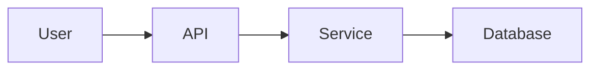

# Documentation Process

## Overview

This document outlines our documentation standards and processes to ensure all features are properly documented as they are implemented.

## Documentation Principles

1. **Document as You Code**: Documentation is written alongside implementation
2. **PARA Method**: Organise docs by Projects, Areas, Resources, Archive
3. **Living Documentation**: Keep docs updated as code evolves
4. **User-Focused**: Write for the intended audience
5. **Commit Integration**: Documentation updates are REQUIRED with every commit

## Documentation Requirements

### For New Features

When implementing a new feature:

1. **Create Project Doc** (`1-projects/`)
   - Feature overview and goals
   - Implementation plan
   - Success criteria
   - Technical decisions

2. **Update Area Docs** (`2-areas/`)
   - Architecture changes
   - Security implications
   - API documentation
   - Performance considerations

3. **Add Resources** (`3-resources/`)
   - Code examples
   - Integration guides
   - Troubleshooting tips

### Documentation Checklist

Before marking a feature complete:

- [ ] Project documentation created/updated
- [ ] Architecture decisions recorded
- [ ] Security review documented
- [ ] API endpoints documented
- [ ] Code examples provided
- [ ] Error scenarios covered
- [ ] Performance metrics defined
- [ ] Migration guide (if needed)

## Documentation Structure

### Project Documents

```markdown
# Feature Name

**Status**: In Progress | Completed | On Hold
**Start Date**: YYYY-MM-DD
**Completion Date**: YYYY-MM-DD

## Overview
Brief description of the feature

## Goals
- Specific objectives
- Success metrics

## Technical Approach
High-level implementation strategy

## Decisions Log
| Decision | Rationale | Date |
|----------|-----------|------|
| ... | ... | ... |

## Implementation Notes
Key learnings and considerations
```

### Area Documents

```markdown
# Area Name

## Overview
Purpose and scope of this area

## Standards
Specific standards for this area

## Guidelines
Best practices and recommendations

## Common Patterns
Reusable patterns and examples

## Anti-patterns
What to avoid and why
```

### Resource Documents

```markdown
# Resource Title

## Purpose
What this resource helps with

## Prerequisites
Required knowledge or setup

## Content
Main resource content

## Examples
Practical examples

## Related Resources
Links to related documentation
```

## Documentation Tools

### Markdown Standards
- Use GitHub Flavored Markdown
- Include code examples with syntax highlighting
- Use tables for structured data
- Add diagrams where helpful (Mermaid)

### Code Examples
```typescript
// Always include complete, runnable examples
// Add comments explaining key concepts
// Show both success and error cases
```

### Diagrams


## Commit Documentation Policy

**Every commit MUST include relevant documentation updates.**

### Pre-Commit Checklist
- [ ] Feature/fix implemented
- [ ] Tests written/updated
- [ ] Documentation updated
- [ ] Examples added (if applicable)
- [ ] Australian English verified

### Documentation Update Matrix

| Change Type | Required Documentation |
|------------|----------------------|
| New Feature | Project doc, API docs, examples |
| Bug Fix | Update affected docs, add troubleshooting |
| Architecture Change | Update architecture.md, security review |
| API Change | API docs, migration guide, examples |
| Security Update | Security guidelines, audit log |
| Performance | Performance guide, metrics |
| Refactoring | Update affected docs only |

### Enforcement
- PR reviews MUST verify documentation updates
- Missing documentation = PR rejection
- Documentation quality is as important as code quality

## Review Process

1. **Self-Review**: Author reviews for completeness
2. **Technical Review**: Code reviewer checks accuracy
3. **Documentation Review**: Separate review for clarity
4. **User Testing**: Validate with target audience

## Maintenance

### Weekly Tasks
- Review and update project statuses
- Archive completed projects
- Update resource links

### Monthly Tasks
- Review area documentation for accuracy
- Update architecture diagrams
- Consolidate learnings into resources

### Quarterly Tasks
- Full documentation audit
- Remove outdated content
- Reorganise as needed

## Documentation Metrics

Track documentation health:
- Coverage: % of features documented
- Freshness: Days since last update
- Usage: Page views and feedback
- Completeness: Checklist compliance

## Common Issues

### Outdated Documentation
- Set up automated reminders
- Link docs to code changes
- Regular review cycles

### Missing Context
- Always explain "why" not just "what"
- Include background information
- Link to related resources

### Poor Organisation
- Follow PARA strictly
- Use clear naming conventions
- Maintain consistent structure

## Tools and Automation

### Documentation Generation
- API docs from code comments
- Type definitions to schemas
- Changelog from commits

### Quality Checks
- Markdown linting
- Link validation
- Spell checking
- Style consistency

## Best Practices

1. **Write for Your Audience**
   - Developers: Technical details
   - Users: How-to guides
   - Stakeholders: High-level overviews

2. **Keep It Current**
   - Update docs with code changes
   - Review regularly
   - Remove outdated content

3. **Make It Discoverable**
   - Clear naming
   - Good search terms
   - Cross-references
   - Table of contents

4. **Ensure Quality**
   - Peer review
   - Test examples
   - Check links
   - Validate accuracy