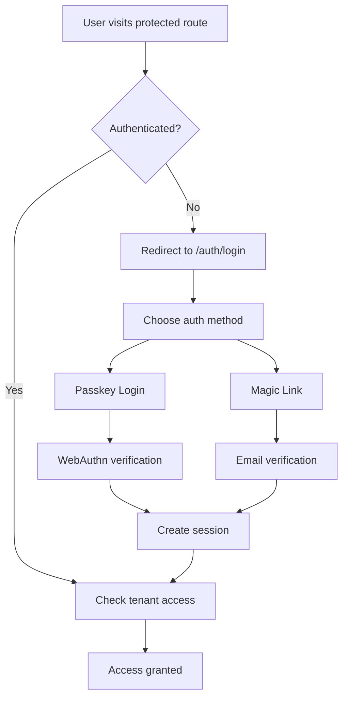

# Authentication Implementation Guide

## Overview

The authentication system implements modern passwordless authentication using **Passkeys (WebAuthn)** as the primary method with **Magic Links** as a fallback for unsupported devices. Built on NextAuth.js v5 with custom WebAuthn integration.

## Architecture

### Core Components

1. **NextAuth.js v5** - Session management and OAuth framework
2. **SimpleWebAuthn** - WebAuthn implementation for passkey support
3. **Drizzle ORM** - Database adapter for user sessions and credentials
4. **Custom Middleware** - Route protection and tenant context

### Authentication Flow



## Implementation Details

### 1. Passkey Authentication

Passkeys provide secure, passwordless authentication using device biometrics or PINs.

#### Registration Flow

```typescript
// Generate registration options
const options = await generatePasskeyRegistrationOptions({
  userId: user.id,
  userEmail: user.email,
  userName: user.name,
})

// User completes WebAuthn ceremony
const credential = await startRegistration(options)

// Verify and store credential
const verification = await verifyPasskeyRegistration(user.id, credential)
```

#### Authentication Flow

```typescript
// Generate authentication options
const options = await generatePasskeyAuthenticationOptions({
  userId: user.id, // Optional for discoverable credentials
})

// User completes WebAuthn ceremony
const assertion = await startAuthentication(options)

// Verify authentication
const verification = await verifyPasskeyAuthentication(assertion)
```

### 2. Magic Link Fallback

For devices that don't support passkeys, users can authenticate via email links.

```typescript
// Send magic link
const result = await fetch('/api/auth/signin/email', {
  method: 'POST',
  headers: { 'Content-Type': 'application/json' },
  body: JSON.stringify({ 
    email: userEmail,
    callbackUrl: '/dashboard',
  }),
})
```

### 3. Session Management

Sessions are managed by NextAuth.js with JWT strategy for scalability.

```typescript
// Get current session
const session = await getAuthSession()

// Get session with tenant context
const { user, tenantId, role } = await getAuthUserWithTenant()

// Require specific roles
await requireTenantAdmin() // owner or admin
await requireTenantOwner() // owner only
```

### 4. Route Protection

Middleware automatically protects routes and resolves tenant context.

```typescript
// middleware.ts handles:
// - Authentication checks
// - Tenant resolution from subdomain/path
// - User-tenant access validation
// - Session context headers
```

## API Routes

### Passkey Registration

- `POST /api/auth/passkey/register/options` - Get registration options
- `POST /api/auth/passkey/register/verify` - Verify registration response

### Passkey Authentication

- `POST /api/auth/passkey/authenticate/options` - Get authentication options
- `POST /api/auth/passkey/authenticate/verify` - Verify authentication response

### NextAuth Routes

- `GET/POST /api/auth/[...nextauth]` - NextAuth.js handlers
- `POST /api/auth/signin/email` - Magic link authentication

## Database Schema

### Users Table

```sql
users (
  id UUID PRIMARY KEY,
  email VARCHAR(255) UNIQUE NOT NULL,
  name VARCHAR(255),
  email_verified TIMESTAMP,
  image VARCHAR(500),
  created_at TIMESTAMP DEFAULT NOW(),
  updated_at TIMESTAMP DEFAULT NOW()
)
```

### Credentials Table

```sql
credentials (
  id UUID PRIMARY KEY,
  user_id UUID REFERENCES users(id),
  credential_id TEXT UNIQUE NOT NULL,
  public_key TEXT NOT NULL,
  counter INTEGER DEFAULT 0,
  transports JSONB,
  name VARCHAR(100),
  created_at TIMESTAMP DEFAULT NOW(),
  last_used TIMESTAMP
)
```

### Sessions Table

```sql
sessions (
  id UUID PRIMARY KEY,
  session_token TEXT UNIQUE NOT NULL,
  user_id UUID REFERENCES users(id),
  expires TIMESTAMP NOT NULL,
  created_at TIMESTAMP DEFAULT NOW()
)
```

### Auth Challenges Table

```sql
auth_challenges (
  id UUID PRIMARY KEY,
  challenge TEXT NOT NULL,
  user_id UUID REFERENCES users(id),
  type VARCHAR(20) NOT NULL, -- 'registration' or 'authentication'
  expires_at TIMESTAMP NOT NULL,
  used BOOLEAN DEFAULT FALSE,
  created_at TIMESTAMP DEFAULT NOW()
)
```

## Security Considerations

### Critical Security Features

1. **Challenge Replay Protection** - Challenges are single-use and time-limited
2. **Counter Validation** - Prevents credential replay attacks
3. **Origin Validation** - WebAuthn verifies the calling origin
4. **Tenant Isolation** - Users can only access authorised tenants
5. **Session Security** - JWT tokens with proper expiration

### Best Practices Implemented

1. **No Password Storage** - Completely passwordless architecture
2. **Device-bound Credentials** - Passkeys can't be phished or stolen
3. **Automatic Cleanup** - Expired challenges and sessions are cleaned up
4. **Secure Headers** - Proper security headers in middleware
5. **Input Validation** - All inputs are validated and sanitised

## Environment Variables

```env
# WebAuthn Configuration
RP_NAME="Gymnastics Model"
RP_ID="localhost"  # Domain for production
ORIGIN="http://localhost:3000"  # Full origin URL

# NextAuth Configuration
AUTH_URL="http://localhost:3000"
AUTH_SECRET="[generate-random-32-char-string]"

# Email Configuration (for magic links)
EMAIL_FROM="noreply@gymnastics-model.com"
```

## Usage Examples

### Client-Side Authentication

```typescript
// Registration
import { startRegistration } from '@simplewebauthn/browser'

const handleRegister = async () => {
  const optionsResponse = await fetch('/api/auth/passkey/register/options', {
    method: 'POST',
    body: JSON.stringify({ email, name }),
  })
  const options = await optionsResponse.json()
  
  const credential = await startRegistration(options)
  
  const verifyResponse = await fetch('/api/auth/passkey/register/verify', {
    method: 'POST',
    body: JSON.stringify({ email, registrationResponse: credential }),
  })
}

// Authentication
import { startAuthentication } from '@simplewebauthn/browser'

const handleLogin = async () => {
  const optionsResponse = await fetch('/api/auth/passkey/authenticate/options', {
    method: 'POST',
    body: JSON.stringify({ email }),
  })
  const options = await optionsResponse.json()
  
  const assertion = await startAuthentication(options)
  
  const verifyResponse = await fetch('/api/auth/passkey/authenticate/verify', {
    method: 'POST',
    body: JSON.stringify({ authenticationResponse: assertion }),
  })
}
```

### Server-Side Session Handling

```typescript
// In API routes
import { getAuthUserWithTenant, requireTenantAdmin } from '@/lib/auth/session-utils'

export async function POST(request: Request) {
  // Require authentication and tenant access
  const { user, tenantId, role } = await getAuthUserWithTenant()
  
  // Require admin permissions
  await requireTenantAdmin()
  
  // Proceed with authorized operation
  return NextResponse.json({ success: true })
}
```

### Page-Level Protection

```typescript
// In page components
import { getAuthSession } from '@/lib/auth/session-utils'
import { redirect } from 'next/navigation'

export default async function ProtectedPage() {
  const session = await getAuthSession()
  
  if (!session) {
    redirect('/auth/login')
  }
  
  return <div>Protected content</div>
}
```

## Testing

### Unit Tests

Tests cover core authentication functions:

```bash
# Run authentication tests
npm test lib/auth

# Test specific component
npm test lib/auth/passkeys.test.ts
```

### Integration Tests

```bash
# Run with integration test flag
RUN_INTEGRATION_TESTS=true npm test
```

### Manual Testing

1. **Registration Flow**
   - Visit `/auth/register`
   - Enter email and optional name
   - Complete WebAuthn ceremony
   - Verify credential is stored

2. **Authentication Flow**
   - Visit `/auth/login`
   - Optionally enter email
   - Complete WebAuthn ceremony
   - Verify session is created

3. **Magic Link Flow**
   - Visit `/auth/login`
   - Enter email
   - Click "Send Magic Link"
   - Check console for development link
   - Follow link to authenticate

## Troubleshooting

### Common Issues

1. **WebAuthn not supported**
   - Check browser compatibility
   - Ensure HTTPS in production
   - Use magic link fallback

2. **Authentication fails**
   - Verify environment variables
   - Check challenge expiration
   - Review server logs

3. **Session not persisting**
   - Check AUTH_SECRET configuration
   - Verify domain settings
   - Review cookie configuration

### Debug Commands

```bash
# Check database state
npm run db:studio

# Verify RLS policies
npm run db:check-rls

# Run specific tests
npm test -- --reporter=verbose
```

## Related Resources

- [Row-Level Security Guide](./row-level-security-guide.md)
- [Tenant Context Implementation](./tenant-context-implementation.md)
- [SimpleWebAuthn Documentation](https://simplewebauthn.dev)
- [NextAuth.js v5 Documentation](https://authjs.dev)